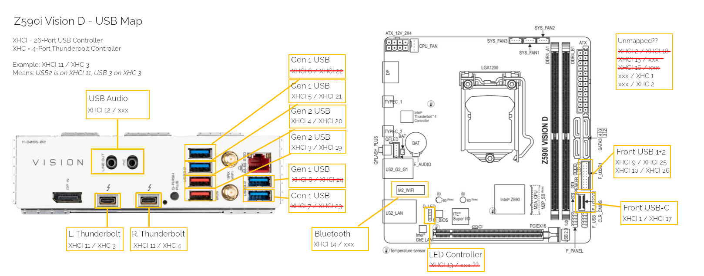

Hi, this is my OpenCore Hackintosh build.

## How to Use

I am not uploading kexts, drivers and the likes, but it should be easy to reconstruct my build from the documentation with reasonings I provide. 

- Set up BIOS (as detailed below)
- Follow [Open Core Tutorials](https://dortania.github.io/OpenCore-Install-Guide/) until you get to the EFI parts.
- Copy `config.plist` from this repo, place it as `EFI/OC/config.plist`.
- Run [GenSMBIOS](https://github.com/corpnewt/GenSMBIOS) with model `MacPro7,1` on it (needs to be this model because of Secure Boot and DRM).
- Download Kexts as detailed below (from their respective websites, except UTBMap which I provide).
- Follow the rest of the [Open Core Tutorials](https://dortania.github.io/OpenCore-Install-Guide/) to install and use macOS.
- Boot into recovery and run `csrutil enable` there.
- Because you have no builtin display, I recommend using [MonitorControl](https://github.com/MonitorControl/MonitorControl) for working brightness buttons.
- Let me know if you have any questions, and feel free to contribute!

### References

- Similar Builds (thank you!)
	- [Same Mainboard, similar GPU, CPU](https://www.tonymacx86.com/threads/guide-oc-monterey-z590i-gigabyte-vision-d-i9-11900k-amd-rx6600.317472/): This is where I started.
	- [Same Mainboard, similar GPU, CPU](https://github.com/SchmockLord/Gigabyte-Z590i-Vision-D-11900k)
	- [Same GPU, CPU, similar mainboard](https://www.tonymacx86.com/threads/success-gigabyte-z590-vision-d-11700k-rx-6600-xt.316601/)
- General 11th generation Intel (Rocket Lake) information: [here](https://github.com/luchina-gabriel/BASE-EFI-INTEL-DESKTOP-11THGEN-ROCKET-LAKE) (repo) and [here](https://github.com/dortania/OpenCore-Install-Guide/pull/343) (unmerged OpenCore Tutorial PR)

## Hardware

[Complete Build on PCPartPicker](https://pcpartpicker.com/b/7gZZxr).

- Mainboard: [Gigabyte Z590i Vision D](https://www.gigabyte.com/Motherboard/Z590I-VISION-D-rev-10/sp#sp)
	- [Ethernet](https://www.intel.com/content/www/us/en/products/sku/184676/intel-ethernet-controller-i225v/downloads.html)
	- [WiFi / BlueTooth](https://www.intel.com/content/www/us/en/products/sku/189347/intel-wifi-6-ax200-gig/specifications.html)
- CPU: [Intel i7-11700k](https://www.intel.com/content/www/us/en/products/sku/212047/intel-core-i711700k-processor-16m-cache-up-to-5-00-ghz/specifications.html)
- GPU: [Radeon 6600 XT](https://www.amd.com/en/products/graphics/amd-radeon-rx-6600-xt)

You should be able to use this configuration as long as your mainboard is the same, your CPU is 11th generation intel, and your GPU is of the 6xxx series. Otherwise, you'll have to make adjustments (or start somewhere else).

## Features

### Hardware

- WiFi: Works, but may not launch properly, requiring a re-boot.
- Bluetooth: Works, but can't be re-activated. If you turn it off, run `sudo pkill bluetoothd`.
	- AirDrop: Unsupported, via [AirportItlwm](https://openintelwireless.github.io/itlwm/FAQ.html#features).
	- Continuity (shared clipboard, handoff): Works One-Way, limited via [AirportItlwm](https://openintelwireless.github.io/itlwm/FAQ.html#features).
	- Screen Mirroring: Works One-Way.
- LAN: Works.
- USB-C Devices: Works.
	- USB / Bluetooth Wakeup: Works.
	- Not all USB Ports are mappable, because macOS supports fewer ports than the Gigabyte Z590i Vision D offers. Therefore, some do not work.
- Thunderbolt: Not Tested.
	- Video Output via Thunderbolt: Doesn't Work (perhaps because of missing iGPU).
	- Audio Output via Thunderbolt: Works (`VT-d` must be enabled).
- iGPU: Doesn't work (11th gen is not supported by Apple)
- Digital Sound (via USB): Works.
- NVMe Drive: Works.
- VDA Decoding / Hardware Acceleration: Works.

### Apps

- Video Playback: Works.
	- Netflix (DRM!): Works.
	- Youtube: Works.
- Steam: Works.
- Programming (Godot / XCode / PyCharm): Works.
- DAW (Bitwig) / Sound Editing: Works.
	- Native Access: Works.
- Video Editing (Final Cut): Works.

## BIOS

Starting out with parameters according to [this guide](https://www.tonymacx86.com/threads/guide-oc-monterey-z590i-gigabyte-vision-d-i9-11900k-amd-rx6600.317472/) (and with reference to [this](https://github.com/luchina-gabriel/BASE-EFI-INTEL-DESKTOP-11THGEN-ROCKET-LAKE) and [this](https://github.com/dortania/OpenCore-Install-Guide/pull/343)).

Keep the [Gigabyte BIOS Manual](https://download.gigabyte.com/FileList/Manual/mb_manual_z590i-vision-d_1001_e.pdf) handy to find your way around the GUI.

- SATA AHCI Mode
- Internal Graphics Auto (11700k iGPU isn't supported in macOS, but Windows may make use of it)

- Above 4GB Decoding Enabled
- Thunderbolt Enabled
- Hyper-Threading Enabled

- VT-d Enabled ([This](https://github.com/dortania/OpenCore-Install-Guide/pull/343) claims it must be off, but it works fine when on. AppleVTD [wants it on](https://elitemacx86.com/threads/how-to-enable-apple-vtd-on-macos-clover-opencore.868/).)
- CSM Disabled
- TPM Disabled
- CFG Lock Disabled (See [here](https://github.com/dortania/OpenCore-Install-Guide/pull/343) and [here](https://github.com/luchina-gabriel/BASE-EFI-INTEL-DESKTOP-11THGEN-ROCKET-LAKE))
- Legacy USB Support Disabled (who needs this?)

Enable Secure Boot and config thunderbolt like [described here](https://github.com/SchmockLord/Gigabyte-Z590i-Vision-D-11900k).
Remember to re-do Secure Boot on OpenCore updates!

## Documentation

### Useful for Changes

- Use [MountEFI](https://github.com/corpnewt/MountEFI) to mount the OpenCore USB EFI.
- Use [ProperTree](https://github.com/corpnewt/ProperTree) to automatically add ACPI, driver, kext and tools to config.plist
- Useful: [config.plist reference](https://dortania.github.io/docs/latest/Configuration.html)
- Use [this config sanity tool](opencore.slowgeek.com) to optimize entries without knowing absolutely everything
- When uploading a new version, remove PlatformInfo entries for privacy reasons.

### Changelog (old to new), starting from [here](https://www.tonymacx86.com/threads/guide-oc-monterey-z590i-gigabyte-vision-d-i9-11900k-amd-rx6600.317472/)

- (2023-05-06) Delete AGPMInjector (hardware specific file)
- (2023-05-06) Disabled Whatevergreen (blanked my screen)
- (2023-05-06) Updated OpenCore and kexts
- (2023-05-06) Pin SecureBootModel to j185f according to [this guide](https://dortania.github.io/OpenCore-Post-Install/universal/security/applesecureboot.html#securebootmodel)
- (2023-05-06) Delete IntelBluetoothInjector, AppleMCEReporterDisabler, AirportBrcmFixup (not needed)
- (2023-05-06) Add e1000=0 to boot-args ([Reasoning Here](https://github.com/luchina-gabriel/BASE-EFI-INTEL-DESKTOP-11THGEN-ROCKET-LAKE))
- (2023-05-06) Replace OpenHFSPlus with HFSPlus driver (supposed to be faster)
- (2023-05-07) Spoof I225-V LAN device ID as I225LM (as per [this](https://github.com/luchina-gabriel/BASE-EFI-INTEL-DESKTOP-11THGEN-ROCKET-LAKE) and [this](https://dortania.github.io/OpenCore-Install-Guide/config.plist/comet-lake.html#deviceproperties)). Remove all the other entries. Now I am able to activate Whatevergreen - it was probably not working because of faulty entries in DeviceProperties.
- (2023-05-07) Remove XHCI-unsupported which is probably not needed.
- (2023-05-07) Remove SASMegaRAID which I don't need. I think this fixed Wi-Fi and Bluetooth stability too?
- (2023-05-07) Enable ExtendBTFeatureFlags for continuity.
- (2023-05-08) Add Secure Boot to BIOS, which (i think) fixed the Apple Store.
- (2023-05-08) Adapt ACPI from [here](https://github.com/SchmockLord/Hackintosh-Intel-i9-10900k-AsRock-Z490-Phantom-ITX-TB3) instead, which is less bloated.
- (2023-05-08) Use MacPro7,1 as spoof platform [as this fixes DRM](https://github.com/acidanthera/WhateverGreen/blob/master/Manual/FAQ.Chart.md) (Netflix etc.)
- (2023-05-08) Clean up unneeded kexts, and document the rest.
- (2023-05-08) Re-Enable VT-D in BIOS and remove `e1000=0` from boot-args. Many claim the i225v will kill the mac, but it runs fine.
- (2023-05-09) Don't delete DMAR and set DisableIoMapper to true. This retains Thunderbolt audio and is [recommended in the docs](https://dortania.github.io/docs/latest/Configuration.html).
- (2023-05-09) Remove unnecessary patch entries: 3 were FixHPET entries, [which is not needed](https://dortania.github.io/Getting-Started-With-ACPI/ssdt-methods/ssdt-easy.html#running-ssdttime) for us. One was PEGP -> GFX0 which [is not needed when using Lilu / Whatevergreen](https://www.insanelymac.com/forum/topic/346381-is-gfx0-patch-needed/). The rest was disabled and thus bloat.
- (2023-05-09) (2023-05-09) Remove `amfi_get_out_of_my_way=1` from boot-args, fixing Native Access, Steam (and other Electron apps). An alternative solution would be to add `ipc_control_port_options=0`, but AMFI is [apparently supported now](https://www.hackintosh-forum.de/forum/thread/56383-macos-13-ventura-beta/?pageNo=100) and the argument can thus safely be removed. The issue was an EXC_GUARD, or more verbosely `ILLEGAL_MOVE on mach port 515`.
- (2023-05-09) Add `AppleIntelI210Ethernet` kexts, fixing LAN. There is a lot of talk on the internet about spoofing it as i225-lm by setting the device-id... Nothing of the sort worked for me, but this kext adds a fitting driver, paired with `e1000=0` in `boot-args` which disables the native LAN driver finally fixes LAN. `DisableIOMapper` and `DisableIOMapperMapping` may also be required (not sure).
- (2023-05-10) Replace USB wake fix with the one [recommended in Dortania](https://dortania.github.io/OpenCore-Post-Install/usb/misc/keyboard.html#method-1-add-wake-type-property-recommended) (DeviceProperties `acpi-wake-type`)
- (2023-05-10) Remove ACPI USB port maps - they don't work in macOS 11+, and we have the USB map kexts anyway.
- (2023-05-11) Remap USB Ports, and add an image of the mapping, as well as templates.

### USB Map

To use my USB map, copy `UTBMap.kext` from `./USB`. To remap, feel free to use the images there as reference for [USBToolbox](https://github.com/USBToolBox/tool).

  

### OpenCore

Currently on OpenCore `0.9.2`, macOS `13.3.3` (Ventura).

- ACPI: kindly mostly copied from [here](https://github.com/SchmockLord/Gigabyte-Z590i-Vision-D-11900k)
	- For reasonings on adding kexts and acpi, see comments in `config.plist`.

### Kexts

- Lilu: Always required
- VirtualSMC: SMC Emulator, always required
- SMCSuperIO: Fan Monitoring
- SMCRadeonGPU: Radeon GPU temperature Monitoring
- SMCProcessor: CPU Temperature Monitoring
- WhateverGreen: Important graphics and DRM fixes
- AirportItlwm: WiFi and Bluetooth
- AppleALCU: Digital-Only Sound
- BlueToolFixup: Bluetooth software stack fixes
- IntelBluetoothFirmware: Works without it; [may improve bluetooth stability](https://openintelwireless.github.io/IntelBluetoothFirmware/FAQ.html#what-does-this-kext-do)?
- IntelBTPatcher: Works without it; [may improve bluetooth stability](https://openintelwireless.github.io/IntelBluetoothFirmware/FAQ.html#what-does-this-kext-do)?
- NVMeFix: NVMe Support
- RadeonSensor: Radeon GPU Support
- RestrictEvents: Various event block fixes, e.g. for the used MacPro7,1 model
- USBToolBox: USB Port Map Library
- UTBMap: USB Port Map / find it inside `./USB`
- AppleIntelI210Ethernet: Adds a LAN driver for i225-v while `e1000=0` in boot-args disables the broken one.
